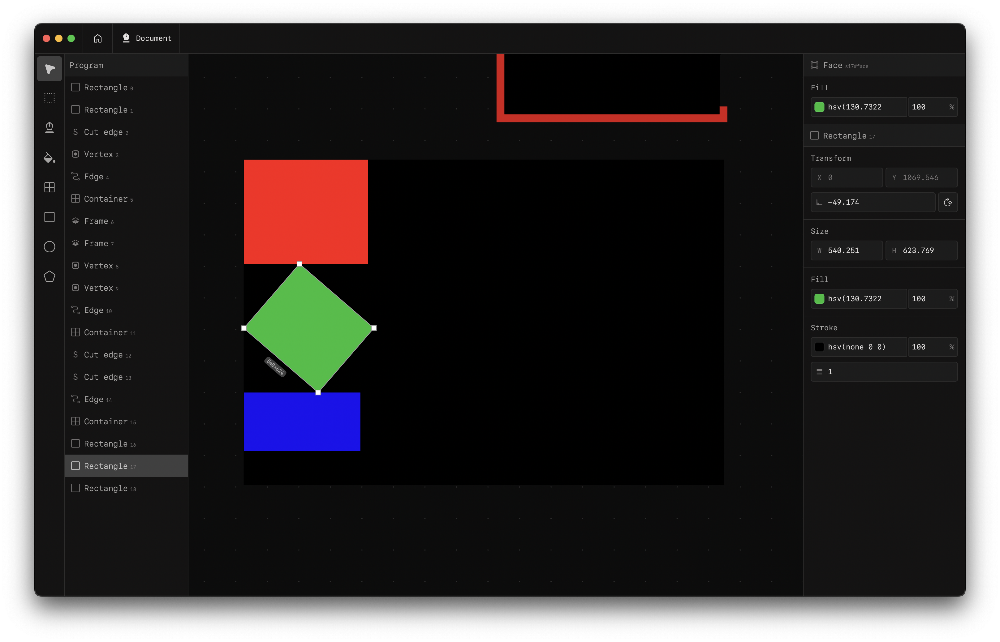
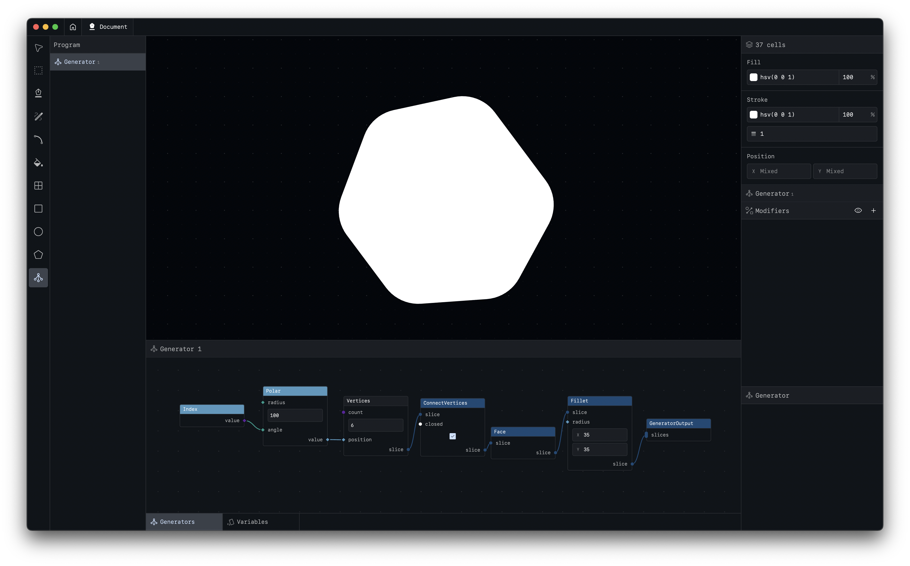

# motif

<!-- Badges -->

An open-source vector graphics, design, and animation tool.

Feel free to [try it out now](https://kekland.github.io/motif) in your browser!

> [!WARNING]
> This project is still in its pre-alpha stage. Expect things to be buggy and incomplete. Feel free to check [TODOS](./TODOS.md) for a list of known issues, and if there's an issue that is not listed, please open a new issue on GitHub.

> [!TIP]
> I'm constantly working on improving the project and welcome any feedback or contributions. If you would like to support the project financially, see the [Support](#support) section below.

## Goals

My goal is to provide a free and open-source alternative to vector graphics design tools like Figma and Illustrator, without the predatory subscription models, paywalls, tracking, other anti-consumer practices, and useless "AI" features.

My aim is to release a beta version in October 2026, and continue to improve the tools based on user feedback and contributions.

The short-term roadmap is in the [TODOS](./TODOS.md) file. A longer-term roadmap will be added once the project reaches a more stable state.

### Current goals

- Figma-like ease of use
- Non-destructive workflows via Generator Nodes - similar to Blender
- Variables, tokens, components
- Multiplayer support (local and hosted)
- Cross-platform - desktops, web, tablets

### Future goals

- Animations
- Raster graphics support
- Raster/vector brushes
- Custom shaders with a node-based editor
- Plugin system
- Plug-and-play MCP support

## Architecture

The architecture of Motif is very similar to CAD software, with a few key ideas adapted for vector graphics. In general, any design document can be thought of as a "program", executing which results in a vector graphic output. The "program" can be modified interactively through the UI, or programmatically through scripts and generator nodes.

The core is split into three parts:
- `kernel`: the low-level core engine responsible for storing the geometric/topological data and performing fundamental operations on it.

- `program`: the high-level layer representing the design document as a program. Program uses the kernel to perform live edits on a design document.

- `scene`: highest-level layer responsible for interacting with the program, managing transactions, history, etc.

I will write about the architecture more in-depth once the project solidifies (around the beta release), as some things are still subject to change.

## Support

I left my full-time job to dedicate all of my time to work on this project and would greatly appreciate any support, whether it's through contributions, feedback, or spreading the word.

If you'd like to support the project financially, you can do so via my [Ko-Fi page](https://ko-fi.com/kekland). I've applied for GitHub Sponsors as well, and will update this section once it's approved.

If you're from Kazakhstan, you can also support the project by reaching out to me directly for local payment options (e.g. Kaspi):
- Telegram: [@kekland322](https://t.me/kekland322)

If there's another way you'd like to support the project, feel free to reach out via email: `kk.erzhan@gmail.com`

## Additional information

The project is still in its early stages, and is currently being developed by myself only. If you're curious about the project, or want to chat about it, feel free to reach out via email: `kk.erzhan@gmail.com`
